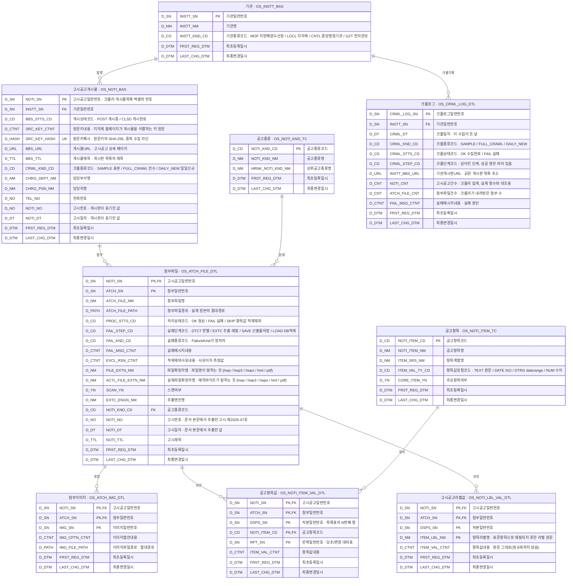

# 공유수면 고시문 추출 파이프라인 (Java)

공유수면 점용·사용 고시류 문서(**HWP 5.0 / 한글 3.0 / HWPX / HML / PDF — 네이티브·스캔본 모두**)에서
텍스트·표·이미지를 추출하고, 표준 필드 스키마로 정규화한 뒤 **PostgreSQL DB에
적재**하는 배치 파이프라인입니다.

| | |
|---|---|
| **하는 일** | 고시문 → 텍스트·표·이미지 추출 → 표준 스키마 정규화 → PostgreSQL 적재 |
| **입력** | HWP 5.0 · 한글 3.0 · HWPX · HML · PDF — 네이티브·스캔본 모두 |
| **산출물** | `*.raw.json` · `*.tables.json` · `*.schema.json` · PostgreSQL 9테이블 · `images/` |
| **스택** | JDK 17 · Maven · picocli · hwplib / hwpxlib / PDFBox · HikariCP + Flyway · PaddleOCR-VL(Python 서브프로세스) |
| **핵심 원칙** | **판별(detect) → 추출(engine) → 매핑(common) → 적재(db)** 4계층 분리 |

이 문서는 **개괄**입니다. 파일·클래스 단위 설명은
[`PROJECT_STRUCTURE.md`](PROJECT_STRUCTURE.md), 판단의 근거는
[`docs/DESIGN_NOTES.md`](docs/DESIGN_NOTES.md)에 있습니다.

## 빠른 시작

```bash
mvn package

# ① DB 없이 추출+매핑만 — 설치가 끝났는지 확인하는 스모크 테스트
LANG=C.UTF-8 java -jar target/extract-pipeline-1.0.0.jar pipeline -i samples -o out/ --no-db

# ② 전량 배치 + PostgreSQL 적재 (접속 정보는 .env / application.properties)
LANG=C.UTF-8 java -jar target/extract-pipeline-1.0.0.jar pipeline -i input/ -o out/
```

DB 스키마는 첫 기동 때 Flyway가 세우므로 DDL을 손으로 돌릴 일은 없습니다.

**요구 사항** — JDK 17+ · Maven 3.6+ · (적재 시) PostgreSQL · (스캔본 처리 시) Python 3와
[`ocr-cli/`](ocr-cli/README.md)의 PaddleOCR-VL 스크립트.

> **로캘이 UTF-8이어야 합니다**(`LANG=C.UTF-8`). 한글 파일명을 다루는데 경로 인코딩은
> `sun.jnu.encoding`이 결정하고 이 값은 `-D`로 재정의되지 않습니다. 없으면
> `InvalidPathException: Malformed input`으로 **전건 실패**합니다. `mvn test`는 이미
> 반영돼 있고, **jar를 직접 실행할 때만** 필요합니다.

## 전체 흐름

```
입력 파일 ─→ CLI ─→ 판별 ─→ 추출 ─→ 매핑 ─→ 적재 ─→ PostgreSQL
  hwp/pdf   picocli  detect  engine  common    db     + images/
                       │       │        │        │
                   스캔본이면  형식별   표 해석   기관→게시물
                   Python OCR 추출기 5종 +정규화  →첨부→항목값
```

계층마다 산출물이 하나씩 떨어집니다 — `*.raw.json`(추출) → `*.tables.json`(표 해석,
진단용) → `*.schema.json`(정규화) → DB. 어느 단계에서 틀어졌는지 그 파일로 좁힙니다.

계층별 계약과 클래스는 [`PROJECT_STRUCTURE.md`](PROJECT_STRUCTURE.md)에 있습니다.

## 디렉터리 구조

```
src/main/java/com/onnara/extract/
├── cli/       서브커맨드 (picocli)
├── detect/    스캔본·형식 판별
├── engine/    형식별 추출기 (hwp · hwp3 · hwpx · hml · pdf · image)
├── common/    표 해석 · 매핑 · 표준 사전 · 동의어
├── scan/      OCR CLI 연동
├── db/        PostgreSQL 적재
└── docs/      문서 생성기 (dict 서브커맨드)

src/main/resources/
├── db/migration/V1__init.sql   스키마 (Flyway)
├── db/standard_terms.json      DB 표준 사전 — 이름의 정의처
├── notice_items.json           공고항목 사전 — 문서 안의 항목을 라벨로 판정
└── notice_types.json           공고종류 사전 — 문서의 종류를 제목으로 판정
```

## 지원 형식

**확장자가 아니라 매직바이트로 라우팅합니다** — 확장자가 내용과 어긋난 파일이 실제로
들어옵니다([왜 그런지](docs/DESIGN_NOTES.md#라우팅은-확장자가-아니라-내용으로-한다)).

| 형식 | 엔진 | 비고 |
|---|---|---|
| HWP 5.0 | hwplib | OLE 복합문서 |
| 한글 3.0 | 자체 파서 | 외부 의존성 없음 |
| HWPX | hwpxlib | OWPML/ZIP |
| HML | JDK DOM | 외부 의존성 없음 |
| PDF | Apache PDFBox | 선분 클러스터링으로 표 탐지 |
| **스캔본** | PaddleOCR-VL | Python CLI 서브프로세스 |

스캔본은 다섯 형식 어디에나 있을 수 있어 형식 판별과 별개로 먼저 가릅니다. 판별 기준과
OCR 계약은 [`PROJECT_STRUCTURE.md` §3·§7](PROJECT_STRUCTURE.md)에 있습니다.

## CLI 사용법

```bash
java -jar target/extract-pipeline-1.0.0.jar <서브커맨드> [옵션]
```

| 서브커맨드 | 하는 일 |
|---|---|
| `pipeline -i 입력 -o 출력` | 추출 → 매핑 → 적재 전 과정. **평소 쓰는 것** |
| `detect 입력` | 스캔본·형식 판별만 (집계 확인용) |
| `extract 입력 -o 출력` | 추출 + 매핑 (`--raw`로 원시 JSON도 저장) |
| `map raw.json -o 출력` | 매핑만 — 사전을 고친 뒤 다시 돌릴 때 |
| `load *.schema.json` | 적재만 — 스키마를 고치고 재적재할 때 |
| `tables raw.json -o 출력` | 표 해석 중간 산출물 |
| `render *.tables.json` | 표를 HTML로 복원 (눈으로 검수) |
| `dict` | 사전 문서 재생성 (`docs/`의 자동 생성분) |

옵션은 `--help`로 봅니다. 진입점 규약은
[`PROJECT_STRUCTURE.md` §8](PROJECT_STRUCTURE.md)에 있습니다.

## 설정

`application.properties`보다 `.env`·환경변수가 우선합니다.

```properties
DB_URL=jdbc:postgresql://localhost:5432/extract
DB_USER=extract
DB_PASSWORD=                       # 파일에 두지 말고 .env / PGPASSWORD로 주입
OCR_CLI_COMMAND=python3            # venv를 쓰면 그 venv의 python 절대경로
OCR_CLI_SCRIPT=ocr-cli/paddleocr_vl_cli.py
MAP_MAX_BODY_CHARS=5000            # 안내문류 적재 제외 임계치 (0이면 제한 없음)
```

```bash
cp .env.example .env   # 이후 값 편집
```

**DB 비밀번호를 파일에 평문으로 두지 마세요** — `.env`나 OS 환경변수(`PGPASSWORD`)로
주입합니다. 임계치를 왜 두는지는
[항목값 적재 제외](docs/DESIGN_NOTES.md#긴-문서는-항목값-적재에서-뺀다-안내문류-차단),
DB를 다시 세우는 절차는
[`PROJECT_STRUCTURE.md` §6.5](PROJECT_STRUCTURE.md#65-개발-db-초기화)에 있습니다.

## 데이터 모델

Flyway 마이그레이션 `V1__init.sql` 하나가 표준도메인 20개와 9테이블을 세웁니다.

**ERD는 논리명과 물리명을 함께 적습니다.** 물리명은 영문 약어 조합이라 한눈에 뜻이 잡히지
않고, 논리명은 SQL에 그대로 쓸 수 없기 때문입니다.



| 논리명 | 물리명 | 무엇의 단위인가 |
|---|---|---|
| 기관 | `OS_INSTT_BAS` | 고시·공고를 수집한 기관 게시판. 입력 폴더 하나가 한 행이다 |
| 고시공고게시물 | `OS_NOTI_BAS` | 게시물 1건. 크롤러 게시물 목록 엑셀 한 줄이 한 행이며, 같은 게시물의 첨부를 묶는 키를 겸한다 |
| 크롤로그 | `OS_CRWL_LOG_DTL` | 하루치 수집에서 기관 하나를 긁은 결과. 성공도 남겨 "오늘 이 기관을 돌긴 했나"에 답한다. 크롤러만 아는 것만 담고 `OS_NOTI_BAS`에서 유도되는 값은 담지 않는다 |
| 공고종류 | `OS_NOTI_KND_TC` | 공고종류 56종. 한 기관이 평균 12종을 발행하므로 기관으로는 종류를 구분할 수 없다 |
| 공고항목 | `OS_NOTI_ITEM_TC` | 표준항목 40종. notice_items.json이 단일 정의처이며 ReferenceSync가 기동 시 upsert한다 |
| 첨부파일 | `OS_ATCH_FILE_DTL` | 파일 1건. 실제 원본 절대경로, 문서 단위 메타(고시번호·고시일자·제목)와 추출 상태 |
| 첨부이미지 | `OS_ATCH_IMG_DTL` | 이미지는 처분 레코드가 아니라 첨부파일의 속성이다 — 한 파일이 레코드 N건을 낳을 때 어느 레코드에 붙일지 정할 근거가 없다 |
| 공고항목값 | `OS_NOTI_ITEM_VAL_DTL` | 항목값. 40개 표준항목을 전부 동등하게 행으로 담는다 |
| 고시공고라벨값 | `OS_NOTI_LBL_VAL_DTL` | 표준항목으로 매핑되지 못한 값. 라벨 원문을 키로 담는다 — `OS_NOTI_ITEM_TC`로 가는 FK가 없는 것이 이 테이블의 전부다 |

기관 → 게시물 → 첨부파일 → (처분) 항목값의 4계층에, 크롤 기록이 옆에 하나 붙습니다.
**항목값은 컬럼이 아니라 행(EAV)으로 담습니다** —
[왜 그런지](docs/DESIGN_NOTES.md#왜-값-컬럼이-아니라-eav인가).

이름은 사람이 그때그때 짓지 않고 [DB 표준 사전](src/main/resources/db/standard_terms.json)에서
조합해 만들고, `DbStandardTest`가 사전과 DDL을 대조합니다. 사전을 지나치고 컬럼을 보태면
빌드가 막힙니다. 규칙은 사업 [데이터 표준화 지침]을 따릅니다:

- 테이블은 `[업무코드]_[의미]_[유형접미사]` — 업무코드 `OS`는 **해양공간**입니다
- 컬럼은 `[수식어]…[분류어]`이고 **마지막 낱말이 도메인을 지시**합니다(`…_NM` → `VARCHAR(300)`)
- 제약조건·인덱스는 `[테이블명]_PK` · `_FK01` · `_IX01`

컬럼별 설명·적재 규칙·DB 초기화 절차는
[`PROJECT_STRUCTURE.md` §6](PROJECT_STRUCTURE.md), 논리명↔물리명 대응표는
[`docs/DB_STANDARD.md`](docs/DB_STANDARD.md), 이름 규칙을 그렇게 정한 이유는
[`docs/DESIGN_NOTES.md`](docs/DESIGN_NOTES.md#이름은-표준-사전이-정합니다)에 있습니다.

## 크롤러 연계

파이프라인 앞에 크롤러가 붙습니다. 스케줄러가 하루에 한 번 돌면서 **새로 게시된 것만**
긁고, 산출물은 두 가지입니다.

| 산출물 | 어느 테이블로 |
|---|---|
| **수집 결과 엑셀** (시트 3장) | `OS_INSTT_BAS` · `OS_NOTI_BAS` · `OS_CRWL_LOG_DTL` |
| **첨부파일 폴더** | `OS_ATCH_FILE_DTL` 이하 |

**기관 정보와 게시물 정보가 모두 이 엑셀에서 옵니다.** 폴더명 파싱은 크롤 산출물이 아닌
파일(수동 수집분)에만 남는 폴백입니다.

시트별 칸→컬럼 대응, 번호 체계, 입력 폴더 규약, 그리고 적재 전에 알아야 할 것들은
[`docs/CRAWLER.md`](docs/CRAWLER.md)에 있습니다.

## 매핑 정교화

고시문은 정보 대부분이 표에 있고 기관마다 서식과 라벨이 다릅니다(`고시일자` / `공고일자` …).
두 단계로 나눠 다룹니다 — **표 해석**(`*.tables.json`으로 서식 판정과 라벨:값을 남김)과
**사전 매핑**(`notice_items.json`이 라벨을 표준항목으로 모음).

사전은 짝으로 둘입니다. 둘 다 표준어 하나에 동의어 여럿을 매다는 같은 모양이고,
`ReferenceSync`가 각각 코드 테이블로 동기화합니다.

| 사전 | 무엇을 판정하나 | 근거 | 어느 테이블로 |
|---|---|---|---|
| `notice_types.json` | 문서의 **종류** (56종) | 고시문 **제목** | `OS_NOTI_KND_TC` |
| `notice_items.json` | 문서 안의 **항목** (40종) | 표·문단의 **라벨** | `OS_NOTI_ITEM_TC` |

표준항목으로 매핑되지 못한 값도 버리지 않고 `OS_NOTI_LBL_VAL_DTL`에 라벨 원문을 키로
남깁니다. 어느 라벨을 사전에 올릴지는 그 테이블의 빈도로 고릅니다.

사전 보강 절차는 [`PROJECT_STRUCTURE.md` §9.1](PROJECT_STRUCTURE.md),
인식하는 라벨 전체 목록은 [`docs/NOTICE_ITEMS.md`](docs/NOTICE_ITEMS.md)에 있습니다.

## 문제가 생겼을 때

**실패·항목값 적재제외도 행으로 남깁니다.** 성공만 적재하면 "첨부 401건 중 추출 0건"인 기관이
DB에서 아예 보이지 않아, 추출 누락과 애초에 없던 자료를 구분할 수 없습니다.
적재 단계에서 넘어진 첨부도 `FAIL_STEP_CD='LOAD'` 행으로 남습니다 — 롤백만 하고 끝내면
그 첨부가 수집조차 안 된 파일과 구별되지 않습니다.

```sql
-- 무엇이 왜 실패했나
SELECT FAIL_STEP_CD, FAIL_KND_CD, count(*)
  FROM OS_ATCH_FILE_DTL WHERE PROC_STTS_CD = 'FAIL' GROUP BY 1, 2 ORDER BY 3 DESC;
```

| 증상 | 볼 곳 |
|---|---|
| 특정 파일이 안 열린다 | `FAIL_KND_CD` — 잠긴 문서는 [`PROJECT_STRUCTURE.md` §3.1](PROJECT_STRUCTURE.md)이 갈래를 나눠 놓았습니다 |
| 표를 잘못 읽은 것 같다 | `render *.tables.json` — 해석한 표를 HTML로 복원해 눈으로 봅니다 |
| 값이 하나도 안 들어갔다 | `dict --unmapped` — 사전에 없는 라벨을 빈도순으로 뽑습니다 |
| 문서는 읽혔는데 항목값이 안 들어갔다 | `PROC_STTS_CD='SKIP'` — [안내문류 차단](docs/DESIGN_NOTES.md#긴-문서는-항목값-적재에서-뺀다-안내문류-차단)에 걸린 것입니다. `EXCL_RSN_CTNT`에 본문 글자 수가 남습니다 |
| 적재하다 죽은 첨부가 있다 | `PROC_STTS_CD='FAIL' AND FAIL_STEP_CD='LOAD'` — 원인은 `FAIL_MSG_CTNT`에 있습니다 |
| 크롤이 안 돈 기관이 있다 | `OS_CRWL_LOG_DTL` — 질의는 [`docs/CRAWLER.md`](docs/CRAWLER.md)에 있습니다 |

## 테스트

```bash
mvn test                       # 전체
mvn test -Dtest=DbStandardTest # DB 표준 검사만
```

`DbLoaderIT`는 PostgreSQL이 있어야 돌고, 표본 파일이 없는 테스트는 건너뜁니다(`Skipped`).

## 새 형식·엔진을 붙이려면

[`PROJECT_STRUCTURE.md` §9](PROJECT_STRUCTURE.md)에 절차가 있습니다 — `DocFormat`에 형식을
더하고, `Extractor`를 구현하고, `DetectorRegistry`에 등록하는 세 단계입니다.

## 관련 문서

**손으로 씁니다**

| 문서 | 내용 |
|---|---|
| [`PROJECT_STRUCTURE.md`](PROJECT_STRUCTURE.md) | 파일·클래스 단위 구조, 계층별 계약 |
| [`docs/CRAWLER.md`](docs/CRAWLER.md) | 크롤러 산출물의 생김새, 입력 폴더 규약 |
| [`docs/DESIGN_NOTES.md`](docs/DESIGN_NOTES.md) | 왜 다른 길로 가지 않았는가 |
| [`ocr-cli/README.md`](ocr-cli/README.md) | PaddleOCR-VL CLI 설치·실행 계약 |

**`dict` 서브커맨드가 생성합니다 — 손으로 고치지 마세요**

| 문서 | 내용 |
|---|---|
| [`docs/DB_STANDARD.md`](docs/DB_STANDARD.md) | 표준단어·도메인·용어(논리명↔물리명)·코드 |
| [`docs/NOTICE_ITEMS.md`](docs/NOTICE_ITEMS.md) | 필드별 설명·값 예시·인식하는 라벨 전체 |
| [`docs/EXTRAS_REVIEW.md`](docs/EXTRAS_REVIEW.md) | 미매핑 라벨 빈도순 집계 |
| [`docs/NOTICE_TYPES_REVIEW.md`](docs/NOTICE_TYPES_REVIEW.md) | 미분류 제목 빈도순 집계 |

DB 이름 규칙의 상위 근거는 사업 산출물 두 건입니다 — 저장소에 두지 않고 사업 문서로
관리합니다.

| 문서 | 이 저장소가 따르는 것 |
|---|---|
| 데이터 표준화 지침 (`OFBD-2210-01`) | 표준 기본 원칙, Naming Rule(주제영역·개체별 명명규칙) |
| 데이터 표준 관리체계 정의서 (`OFBD-3210-02`) | 표준단어·용어·도메인 항목 정의, 금칙단어 선정 규칙 |
