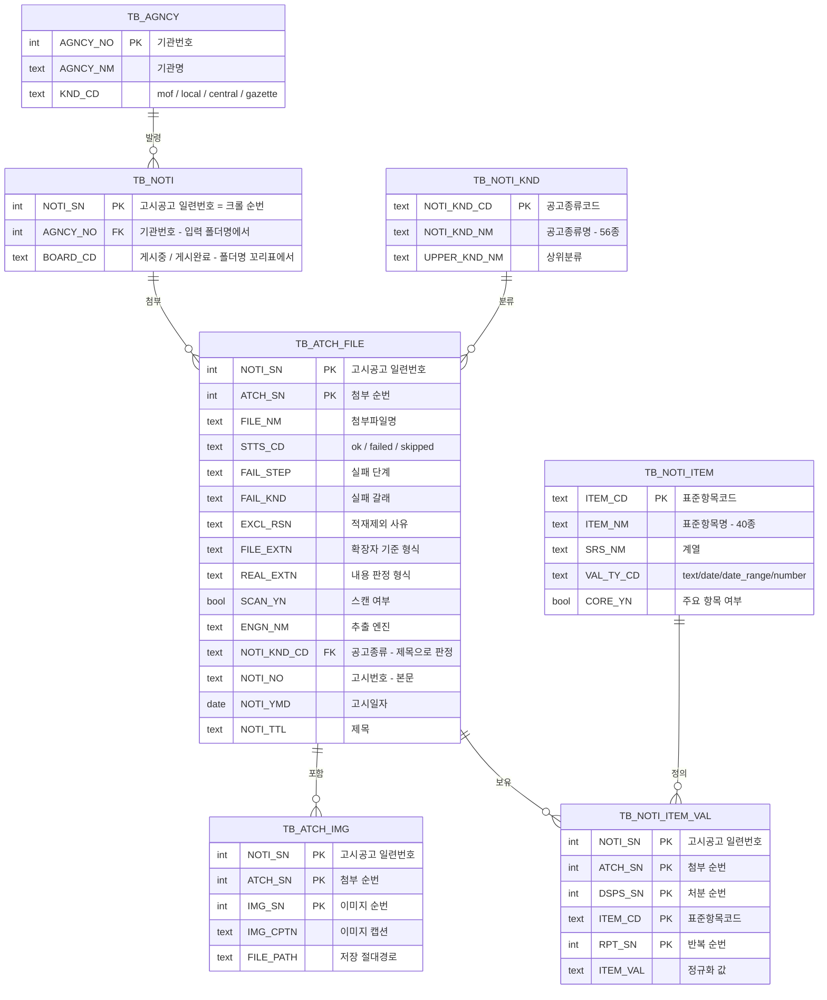

# 공유수면 고시문 추출 파이프라인 (Java)

공유수면 점용·사용 고시류 문서(**HWP 5.0 / 한글 3.0 / HWPX / HML / PDF — 네이티브·스캔본 모두**)에서
텍스트·표·이미지를 추출하고, 표준 필드 스키마로 정규화한 뒤 **PostgreSQL DB에
적재**하는 배치 파이프라인입니다.

핵심 원칙: **판별(detect) → 추출(engine) → 매핑(common) → 적재(db)** 4계층 분리.
PaddleOCR-VL은 Java에서 직접 구동할 수 없으므로 스캔본 처리만 Python CLI
스크립트(`ocr-cli/`)에 맡기고, Java 파이프라인이 **서브프로세스로 실행**합니다.

## 전체 흐름

```
입력 파일 (.hwp / .hwpx / .hml / .pdf)   ← 확장자와 내용이 어긋날 수 있고, 모두 스캔본일 수 있음
        │
        ▼
CLI: extract.jar pipeline (picocli)
        │
        │  [1차 분기] 스캔본 판별 — DetectorRegistry
        │
        ├── 스캔본 ──► ScanOcrRunner ──서브프로세스──► PaddleOCR-VL CLI (ocr-cli/, Python)
        │
        └── 네이티브 ── [2차 분기] 형식별 Extractor (매직바이트로 판정 — DocFormat)
                ├─ HWP 5.0 →  HwplibExtractor  (hwplib)
                ├─ 한글 3.0 →  Hwp3Extractor    (자체 파서, 외부 의존성 없음)
                ├─ HWPX   →  OwpmlExtractor   (hwpxlib)
                ├─ HML    →  HmlExtractor     (JDK DOM, 외부 의존성 없음)
                └─ PDF    →  PdfBoxExtractor  (Apache PDFBox + 선분 클러스터링 표 탐지)
                │
                └── + 임베디드 이미지는 파일로 저장하고 images 메타만 기록 (OCR 안 함)
        │
        ▼
raw JSON (공통 계약 — snake_case, Jackson DTO)
        ▼
TableInterpreter (표 서식 판정 + 라벨:값 추출 + 사전 매핑 판정)
        ▼
표 해석 JSON *.tables.json   ← 진단용 중간 산출물 (`--tables` 지정 시 저장)
        ▼
Mapper.mapToSchema (문단 메타·라벨 + 표 해석 결과 적용 + 값 정규화)
        ▼
LoadPolicy (본문 분량 측정 → 안내문류면 excl_rsn 기록, 적재만 제외)
        ▼
표준 스키마 JSON {"file_nm", "noti_sn", "body_char_cnt", "records": [...], "images": [...]}
        ▼
DbLoader (PostgreSQL JDBC + HikariCP)
        ▼
PostgreSQL (TB_AGNCY → TB_NOTI → TB_ATCH_FILE → TB_NOTI_ITEM_VAL) + images/ 폴더
```

## 지원 형식

| 형식 | 판별기 | 추출 엔진 | 비고 |
|---|---|---|---|
| HWP 5.0 | `HwpScanDetector` | `HwplibExtractor` (hwplib) | 이미지 위치 복원 불가(BinData 전체 추출), 확장자는 스트림명 폴백 |
| 한글 3.0 | `Hwp3ScanDetector` | `Hwp3Extractor` (자체 파서) | 조합형(KSSM) 문자·표 좌표 복원, 캡션 추출. 외부 의존성 없음 |
| HWPX | `HwpxScanDetector` | `OwpmlExtractor` (hwpxlib) | 인라인 태그(`<hp:fwSpace/>` 등) 텍스트 잘림 방지 처리 |
| HML | `HmlScanDetector` | `HmlExtractor` (JDK DOM) | ColSpan/RowSpan 병합 구조 복원 |
| PDF | `PdfScanDetector` | `PdfBoxExtractor` | 선분 클러스터링 표 탐지, 도장 제외 휴리스틱 |

### 라우팅은 확장자가 아니라 내용으로 한다

표의 첫 칸이 확장자가 아니라 형식 이름인 이유입니다. 판별기·추출기 선택은 파일 앞부분의
**매직바이트**로 합니다(`DocFormat`). 고시류 코퍼스에는 확장자와 내용이 어긋난 파일이 흔한데,
확장자만 보면 읽을 수 있는 문서를 형식 판정 하나 때문에 버리게 됩니다.

- HWPX 컨테이너를 `.hwp`로 저장한 파일 → 예전에는 hwplib으로 가 `NOT_COMPOUND_FILE` 실패,
  지금은 hwpxlib으로 라우팅돼 정상 처리됩니다.
- 한글 3.0 파일도 확장자는 똑같이 `.hwp`라, 서명(`HWP Document File V3.00`)으로만 갈립니다.

판정할 수 없는 파일은 지금까지처럼 **확장자로 폴백**합니다 — 새 규칙이 기존 동작을 좁히지
않습니다. `TB_ATCH_FILE.FILE_EXTN`은 파일명 확장자를 그대로 유지하고, 판정된 실제 형식은
`TB_ATCH_FILE.REAL_EXTN`에 따로 남깁니다. 둘이 다른 행이 곧 확장자가 어긋난 파일 목록입니다.

```sql
SELECT FILE_NM, FILE_EXTN, REAL_EXTN
  FROM TB_ATCH_FILE WHERE REAL_EXTN IS NOT NULL AND FILE_EXTN <> REAL_EXTN;
```

스캔 판별 기준(다섯 형식 공통):

```
스캔본 = 네이티브 본문 텍스트가 한 글자도 없다 AND 임베디드 이미지가 1개 이상
```

**이미지의 개수·크기·면적은 판정 근거가 아닙니다.** 사진이 지면 대부분을 차지한다는 것만으로는
스캔본이 아닙니다 — 붙임 현장사진·위치도처럼 본문이 사진으로 채워진 네이티브 문서가 흔합니다.
지면 점유율도 신호가 되지 않습니다: 본문 전체가 이미지 한 장인 문서와 붙임 사진이 여러 장
들어간 문서를 실측하면 둘 다 **본문 폭의 96~100%, 인쇄 영역의 약 40%**로 구분되지 않습니다.

임계치가 한 글자라 판별의 부담은 전부 "본문 텍스트를 빠짐없이, 그리고 본문만 세는가"에
있습니다. 표 셀·중첩 표·글상자·캡션까지 세되, 머리말·꼬리말·각주는 세지 않습니다
(진짜 스캔본에도 머리글·쪽번호는 남아 있어, 세면 반대 방향 오판이 납니다).

PDF도 같은 규칙을 쓰지만 **첫 페이지에만** 적용합니다 — 첫 페이지에서 텍스트가 한 글자라도
뽑히면 네이티브고, 한 글자도 없으면서 이미지가 있으면 스캔본입니다. 다만 PDFBox는 페이지
텍스트를 평면화해서 머리말·꼬리말을 구조적으로 제외할 수 없어, 스캔 페이지에 쪽번호나
전자문서 스탬프 텍스트가 남아 있으면 네이티브로 판정됩니다(그 경우 페이지마다 "텍스트가 없는
페이지입니다" 경고가 남습니다).

## 디렉터리 구조

```
src/main/java/com/onnara/extract/
├── cli/          picocli 진입점 — Main + 7개 서브커맨드
├── detect/       1차 분기: 형식 판별(DocFormat) + 스캔본 판별 (ScanDetector 구현체 5종)
├── engine/       2차 분기: 형식별 네이티브 추출기 (Extractor 구현체 5종)
├── common/       형식 공통 계층 — raw JSON 모델, 매퍼, 동의어 사전, 날짜/주소 휴리스틱
├── scan/         스캔본 처리 — PaddleOCR-VL CLI 서브프로세스 실행기
└── db/           PostgreSQL 적재 (HikariCP + Flyway)

src/main/resources/
├── application.properties   DB 접속·OCR CLI 실행 설정 (설정의 단일 출처)
├── synonyms.json            표준항목 40종 + 문서 메타 5종 사전 (매핑의 단일 출처)
├── notice_types.json        공고종류 56종 레지스트리
└── db/migration/            Flyway 마이그레이션 (V1__init.sql)

src/test/java/...   JUnit 5 — detect/engine/common/scan 단위 테스트 + samples/ 기반 회귀 테스트
samples/             실제 고시문 픽스처 (형식·스캔 여부별)
ocr-cli/             스캔본 OCR용 PaddleOCR-VL Python CLI (ScanOcrRunner가 서브프로세스로 호출)
```

`common/`에는 계층을 가로지르는 공용 유틸도 있습니다: `Errors`(예외 → 원인 체인 사유 문장 —
모든 `[실패]` 로그의 출처), `ImageFormats`(저장 확장자 판별), `DocumentSize`·`LoadPolicy`
(적재 여부 판정), `table/TableRenderer`(표 → HTML 복원). `detect/`에는 실패 갈래 분류
`FailureKind`·`FailureClassifier`와 보호 상태 판별 `DocProtection`이 있습니다.

## 요구 사항

- JDK 17 이상
- Maven 3.6 이상
- (DB 적재 시) PostgreSQL 접근 가능한 인스턴스
- (스캔본 처리 시) Python 3 + `ocr-cli/`의 PaddleOCR-VL 스크립트(설치는 `ocr-cli/requirements.txt`).
  없으면 스캔본 파일만 `[실패]` 처리되고 네이티브 파일은 정상 처리됩니다.
- 한글 파일명 경로를 다루므로 로캘이 UTF-8이어야 합니다(`LANG=C.UTF-8` 등).
  `mvn test`는 surefire 설정에 이미 반영되어 있어 별도 조치가 필요 없지만,
  **jar를 직접 실행할 때는 로캘이 필요합니다.** 없으면 한글 파일명을 열지 못해
  `FileNotFoundException` / `InvalidPathException: Malformed input`으로 **전건 실패**합니다
  (`-Dfile.encoding=UTF-8`만으로는 부족합니다 — 경로 인코딩은 `sun.jnu.encoding`이 결정하고
  이 값은 `-D`로 재정의되지 않습니다).

  ```bash
  LANG=C.UTF-8 java -jar target/extract-pipeline-1.0.0.jar pipeline -i input -o out
  ```

## 빌드

```bash
mvn package
```

`target/extract-pipeline-1.0.0.jar`(fat-jar)가 생성됩니다.

## CLI 사용법

```
java -jar target/extract-pipeline-1.0.0.jar <서브커맨드> [옵션]
```

| 명령 | 역할 |
|---|---|
| `pipeline -i input/ -o out/ [--no-db] [--raw] [--tables]` | 배치: 판별→추출→표해석→매핑→적재 일괄 |
| `detect 파일...\|폴더 [--json] [--summary] [--failures f.json]` | 스캔 여부 분류·집계 (추출·OCR 없음) |
| `extract 파일...\|폴더 -o out/ [--raw] [--no-images] [--engine hwplib]` | 추출+매핑 (DB 적재 없음, 엔진 강제 지정 가능) |
| `tables raw.json... -o out/ [--summary]` | 표 해석 전용 (raw JSON → 표 해석 JSON) |
| `render raw.json...\|폴더 -o out/` | **표 복원 전용 (raw JSON → HTML, 검수용)** |
| `map raw.json... -o out/` | 매핑 전용 (raw JSON → 스키마 JSON) |
| `load schema.json...` | DB 적재 전용 (재적재·스키마 변경 시 단독 실행) |
| `dict [-o docs/SYNONYMS.md] [--review out/]` | 동의어 사전·미매핑 라벨 검토 문서 생성 |

공통 옵션: `--raw`(원시 결과도 저장), `--tables`(표 해석 중간 결과도 저장),
`--no-images`(이미지 저장 생략), `--failures <경로>`(실패 건만 JSON으로 저장),
`--stacktrace`(실패 시 스택 트레이스도 출력).
DB 접속·OCR 실행 정보는 CLI 옵션이 아니라 `application.properties` 및
`.env`에서 읽습니다(우선순위: OS 환경변수 > `.env` > `application.properties`).
파일 단위 실패는 `[실패] <파일>: (<단계>) <사유>` 로그만 남기고 배치는 계속
진행합니다(배치 격리). `TB_ATCH_IMG.FILE_PATH`에는 저장된 이미지의 **절대경로**가
기록됩니다(리눅스 서버에서 파일을 절대경로로 참조).

### 예시

```bash
# DB 없이 추출+매핑만 (스모크 테스트)
java -jar target/extract-pipeline-1.0.0.jar pipeline -i samples -o out/ --no-db

# 스캔 여부만 확인
java -jar target/extract-pipeline-1.0.0.jar detect samples --json

# 전체 문서 중 스캔본이 몇 개인지만 집계 (파일별 목록 없이)
java -jar target/extract-pipeline-1.0.0.jar detect input/ --summary

# PostgreSQL까지 적재 (접속 정보는 application.properties에서)
java -jar target/extract-pipeline-1.0.0.jar pipeline -i input/ -o out/

# 매핑 진단: 표를 어떻게 읽었는지 중간 산출물로 확인
java -jar target/extract-pipeline-1.0.0.jar pipeline -i samples -o out/ --no-db --tables

# 동의어 사전 문서 + 미매핑 라벨 검토 리포트 생성
java -jar target/extract-pipeline-1.0.0.jar dict --review out/

# 판별 실패 사유를 갈래별로 보고, 전건 목록을 파일로 남기기
java -jar target/extract-pipeline-1.0.0.jar detect input/ --summary --failures out/detect-failures.json

# 추출한 표를 원본 병합 그대로 HTML로 복원 (검수용)
java -jar target/extract-pipeline-1.0.0.jar pipeline -i input/ -o out/ --no-db --raw
java -jar target/extract-pipeline-1.0.0.jar render out/ -o out/
```

## 매핑 정교화 — 표 해석과 동의어 사전

고시문은 정보 대부분이 표에 있고, 기관마다 서식과 라벨이 다릅니다
(`고시일자` / `공고일자` …). 이를 두 단계로 나눠 다룹니다.

**1. 표 해석 중간 단계 (`*.tables.json`)** — 표준 스키마는 "어느 필드가 무슨 값이
됐는가"만 남기므로, 값이 비었을 때 표를 잘못 읽은 것인지 사전에 라벨이 없는 것인지
구분되지 않습니다. 중간 단계는 표별 서식 판정(`kind`), 병합 셀을 정확히 읽었는지
(`span_aware`), 각 라벨의 **원본 격자 좌표**와 사전 매핑 여부를 그대로 남깁니다.

**2. 동의어 사전 (`src/main/resources/synonyms.json`)** — 사전 본문은 이 파일 하나이며,
필드 설명·예시·검토 메모를 함께 담습니다. 동의어는 사람이 읽는 형태(`점용·사용의 장소`)로
적으면 되고 로드할 때 정규화됩니다. 같은 라벨이 두 필드에 중복 등재되면 **기동 시
오류로 중단**되어 매핑 충돌이 배포 전에 드러납니다.

검토 문서는 `dict` 서브커맨드로 생성합니다(손으로 고치지 않습니다).

| 문서 | 내용 |
|---|---|
| `docs/SYNONYMS.md` | 필드별 설명·값 예시·인식하는 라벨 전체 목록, 정규화 규칙, 보강 절차 |
| `docs/EXTRAS_REVIEW.md` | 미매핑 라벨 빈도순 집계(예시 값·출현 문서), 표준 필드 채움률, 판단 기준 |

사전 보강은 **표본이 아니라 전량 집계**로 판단합니다 — 라벨 표기 습관이 기관 단위로
몰려 다니기 때문에, 일부만 표본으로 보면 특정 기관의 표기가 통째로 누락됩니다.
라벨을 추가한 뒤 파이프라인을 다시 돌리면 파일 단위 멱등 적재라 기존 문서도
갱신되어, `extras`에 있던 값이 표준 컬럼으로 승격됩니다.

## 설정 (`application.properties` + `.env`)

DB 접속과 OCR 실행 정보는 아래 세 곳에서 읽으며, 우선순위는
**OS 환경변수 > `.env` > `application.properties`**입니다. 기본값은
`application.properties`에 두고, 서버마다 다른 값(접속 정보·비밀번호 등)은
`.env`로 덮어씁니다.

```properties
# application.properties (빌드에 포함되는 기본값)
db.url=jdbc:postgresql://localhost:5432/extract
db.user=extract
db.password=
db.pool.max-size=5

ocr.cli.command=python3
ocr.cli.script=ocr-cli/paddleocr_vl_cli.py
ocr.cli.timeout-sec=300

# 본문이 이 글자 수를 넘으면 안내문류로 보고 DB 적재만 건너뜀 (0이면 제한 없음)
map.max-body-chars=5000
```

### 리눅스 서버 배포 — `.env`로 환경변수 관리

리눅스 서버에서는 접속 정보를 빌드 산출물이 아닌 `.env` 파일로 관리합니다.
`.env.example`을 복사해 값을 채우세요(`.env`는 커밋 대상이 아닙니다).

```bash
cp .env.example .env   # 이후 값 편집
```

```dotenv
# .env — 실행 디렉터리에서 자동 로드(다른 위치면 APP_ENV_FILE로 경로 지정)
DB_URL=jdbc:postgresql://localhost:5432/extract
DB_USER=extract
DB_PASSWORD=            # 또는 OS 환경변수 PGPASSWORD / DB_PASSWORD
DB_POOL_MAX_SIZE=5

OCR_CLI_COMMAND=python3            # venv 사용 시 해당 python 절대경로
OCR_CLI_SCRIPT=ocr-cli/paddleocr_vl_cli.py
OCR_CLI_TIMEOUT_SEC=300

MAP_MAX_BODY_CHARS=5000            # 안내문류 적재 제외 임계치 (0이면 제한 없음)
```

- DB 비밀번호는 파일(`application.properties`)에 평문으로 두지 말고
  `.env` 또는 OS 환경변수 `PGPASSWORD`/`DB_PASSWORD`로 주입하세요.
- `OCR_CLI_COMMAND`는 가상환경을 쓰면 해당 venv의 `python` 절대경로로
  지정하세요.

## 스캔본 OCR — PaddleOCR-VL CLI (`ocr-cli/`)

PaddleOCR-VL을 구동하는 Python 스크립트(`ocr-cli/paddleocr_vl_cli.py`)가 저장소에
포함돼 있습니다. `scan/ScanOcrRunner`가 아래 계약으로 **서브프로세스를 실행**합니다.
설치·상세는 [`ocr-cli/README.md`](ocr-cli/README.md) 참고.

```
<ocr.cli.command> <ocr.cli.script> \
    --source-file <원본파일명> \
    --file-type <pdf|hwp|hwpx|hml> \
    --output <raw.json 출력 경로> \
    <입력 파일...>

입력 파일 — 둘 중 하나:
  · 스캔 PDF 원본 1개 (스크립트가 페이지 렌더링 후 VLM 추론)
  · 스캔 HWP/HWPX/HML에서 Java가 추출한 임베디드 이미지 경로 N개

종료 코드 0 → --output 경로에 raw JSON 계약(위 다이어그램) 파일 생성.
              scan_yn은 Java가 true로 강제하고, 계약 외 필드는 무시합니다.
              stdout/stderr는 로그로만 취급합니다.
종료 코드 ≠0 또는 제한 시간 초과 → 해당 파일만 [실패] 처리.
```

### 네이티브 문서에 삽입된 이미지는 OCR하지 않습니다

**OCR은 스캔 판정을 받은 파일만 탑니다.** 네이티브 문서(본문 텍스트가 있는 문서)에 붙임
현장사진·위치도가 들어 있어도 그 이미지는 파일로 저장하고 `images` 메타만 기록하며, 사진
속 글자를 본문에 섞지 않습니다.

따라서 네이티브 문서를 처리할 때 Python 서브프로세스는 실행되지 않습니다 — 배치 시간이
문서의 삽입 이미지 개수에 좌우되지 않고, `scan_yn=false`인 문서의 `content`에는 항상
네이티브로 읽어 낸 문단·표만 담깁니다.

`paddleocr` 미설치 등으로 스크립트를 실행할 수 없으면(경로 확인: `ocr.cli.script`)
스캔본 파일만 `[실패]` 처리되고, 네이티브 파일 처리에는 영향이 없습니다.

### OCR 전에 스캔본이 몇 건인지 먼저 세기

`detect --summary`는 판별 단계만 돌립니다 — 추출·매핑·DB 적재는 물론 OCR 서브프로세스도
띄우지 않으므로 전체 문서에 돌려도 비용은 파일 파싱뿐입니다. 스캔본 건수를 먼저 알면
배치 소요 시간과 `ocr.cli.timeout-sec`(파일당 제한)를 가늠할 수 있습니다.

```bash
java -jar target/extract-pipeline-1.0.0.jar detect input/ --summary
```

```
[집계] 총 8개 — 스캔본 1개(12.5%), 네이티브 7개(87.5%), 판별 실패 0개
       hml   총 3개 · 스캔본 0 · 네이티브 3 · 실패 0
       hwp   총 2개 · 스캔본 0 · 네이티브 2 · 실패 0
       hwpx  총 3개 · 스캔본 1 · 네이티브 2 · 실패 0
```

판별 실패(지원하지 않는 확장자, 손상 파일)는 네이티브가 아니라 별도로 세고 비율의
분모에서도 빠집니다 — 실패를 네이티브에 합치면 스캔본 비중이 실제보다 낮게 보입니다.
`--json`을 함께 주면 `summary` / `by_extension` / `by_failure_kind` /
`files`(`--summary`면 생략) 구조로 출력됩니다.

## 실패 사유 읽기

### 판별 실패

전량 배치에서 나오는 수백 건의 실패는 "판별 실패 203개"라는 총계만으로는 손쓸 수 없습니다.
**암호만 있으면 되는 것**과 **사용자도 못 여는 DRM**과 **포기할 것**(손상 파일)은 대응이 전혀 다릅니다.
그래서 갈래별로 나눠 셉니다(`--summary`에서도 나옵니다).

> 예전에 가장 큰 갈래였던 **한글 3.0 구버전**과 **확장자 개명**은 더 이상 실패가 아닙니다.
> 한글 3.0은 전용 엔진이 읽고, 개명 파일은 내용 기반 라우팅이 흡수합니다. 지금 이 갈래로
> 떨어지는 건은 "구버전이라 대상이 아니다"가 아니라 **실제로 깨진 파일**입니다.

```
[실패 사유] 총 54개
       PASSWORD_PROTECTED   38개  열기 암호가 설정돼 있습니다 — 암호 해제본이 필요합니다
                          예) input/2015_고시_001.hwp
       ZIP_CORRUPT          10개  ZIP 구조가 손상돼 항목을 읽을 수 없습니다
       DRM_PROTECTED         6개  DRM 보안 문서입니다 — DRM이 해제된 사본이 필요합니다
       …
```

### 잠긴 문서는 "왜 못 여는지"까지 갈라 셉니다

열리지 않는다는 사실은 같아도 대응이 전혀 다릅니다. 그래서 `DocProtection`이 파일이 선언한
**보호 플래그**를 근거로 갈래를 가릅니다(HWP는 FileHeader 속성 비트, HWPX는
`META-INF/manifest.xml`의 ODF 암호화 선언). 예외 메시지에 "password"가 들어 있는지로 가르지
않습니다 — 그건 라이브러리가 무슨 문장을 쓰느냐일 뿐 문서의 성질이 아닙니다.

- **배포용 문서(HWP)는 실패가 아닙니다.** 열쇠가 파일 안에 있어 hwplib이 `ViewText`를
  복호화하며, 본문·표·이미지가 정상 추출됩니다. 그래도 실패했다면 암호 문제가 아니라
  구조 해석 문제이므로 `DISTRIBUTION_UNSUPPORTED`로 따로 셉니다 — 암호 해제본을 받아 봐야
  소용없다는 뜻입니다.
- **암호화된 HWPX는 손쓸 방법이 없습니다.** ODF 표준 AES + PBKDF2라 키가 사용자 암호에서
  나오고, `Preview/PrvText.txt`까지 잠겨 미리보기조차 건질 수 없습니다. 사유에 알고리즘과
  잠긴 항목 목록을 실어, 다시 열어 보지 않고도 판단할 수 있게 합니다.

```
[실패] …고시.hwpx: (판별) HWPX 항목이 암호화돼 있습니다(aes256-cbc / pbkdf2)
       — 암호를 알아야 열 수 있습니다. 암호화 항목: Contents/header.xml,
         Contents/section0.xml, Preview/PrvText.txt, settings.xml
```

| 갈래 | 뜻 | 대응 |
|---|---|---|
| `HWP3_LEGACY` | 한글 3.0인데 자체 파서가 못 읽음 | 손상 여부 확인(구버전이라서가 아님) |
| `NOT_COMPOUND_FILE` | `.hwp`인데 아는 서명이 하나도 없음 | 헤더 손상 또는 지원 대상 아닌 형식 |
| `NOT_ZIP` | `.hwpx`인데 아는 서명이 하나도 없음 | 헤더 손상 또는 지원 대상 아닌 형식 |
| `PASSWORD_PROTECTED` | 열기 암호(HWP 암호설정 비트 / HWPX PBKDF2) | 암호 해제본 확보 — **한글에서도 안 열림** |
| `DRM_PROTECTED` | DRM 보안 문서 | **사용자도 못 엶** — DRM 해제본 확보 |
| `DISTRIBUTION_UNSUPPORTED` | 배포용인데 본문 해석 실패 | 개별 확인 — 암호 문제가 아님 |
| `ENCRYPTED` | 암호화는 분명한데 갈래 미상 | 원본 상태 확인 |
| `ZIP_CORRUPT` / `XML_PARSE` | 컨테이너·본문 XML 손상 | 원본 재수집 |
| `DOCUMENT_PARSE` | 컨테이너는 정상, 내부 구조에서 깨짐 | 개별 확인(라이브러리 미지원 레코드일 수 있음) |
| `PDF_LOAD` | PDF를 열지 못함 | 서명 유무를 상세에서 확인 |
| `EMPTY_FILE` / `FILE_ACCESS` | 0바이트 / 경로·권한 문제 | 수집 단계 점검 |
| `OUT_OF_MEMORY` | 파일 하나가 힙을 다 씀 | `-Xmx` 상향 또는 해당 파일 제외 |

갈래는 **파일 앞부분의 매직바이트**(라우팅과 같은 `DocFormat`)와 **원인 체인의 맨 끝 예외**
두 가지로 판정합니다. 라이브러리는 "읽지 못했다"까지만 말해 주지만, 헤더를 직접 보면
"한글 3.0이다"와 "정상 컨테이너인데 안이 깨졌다"가 갈립니다. 라우팅과 실패 분류가 같은 근거를
써야 "라우팅은 HWPX로 보냈는데 실패 갈래는 HWP 얘기를 한다" 같은 어긋남이 생기지 않습니다.

전건 목록은 `--failures`로 저장합니다 — 재처리 대상을 그대로 넘길 수 있습니다.

```bash
java -jar target/extract-pipeline-1.0.0.jar detect input/ --summary --failures out/detect-failures.json
```

```json
{"total": 23702, "failed": 54, "failures": [
  {"file": "input/2015_고시_001.hwp", "ext": "hwp", "kind": "PASSWORD_PROTECTED",
   "description": "열기 암호가 설정돼 있습니다 — 암호 해제본이 필요합니다(한글에서도 암호 없이는 열리지 않습니다)",
   "error": "열기 암호가 설정된 문서입니다 — 암호 없이는 한글에서도 열리지 않습니다"}
]}
```

판별 중 한 파일에서 `OutOfMemoryError`가 나도 그 건만 `OUT_OF_MEMORY`로 세고 배치는
계속됩니다 — 수만 건 배치가 파일 하나 때문에 통째로 멈추지 않습니다.

### 추출 실패

추출 단계도 같은 규약을 씁니다. 로그에 **어느 단계에서 깨졌는지**와 **원인 체인**이 함께
남습니다(예전에는 맨 바깥 예외의 메시지만 찍혀 "읽지 못했다"는 사실만 남았습니다).

```
[실패] input/개명파일.hwpx: (판별) UncheckedIOException: HWPX 스캔 판별 실패: … [원인: ZipException: zip END header not found] (실제 내용은 HWP 5.0 컨테이너입니다)
[실패] input/스캔본.hwpx: (추출) ScanOcrException: OCR 프로세스 실패(종료 코드 1): paddleocr(PaddleOCR-VL)가 설치되어 있지 않습니다. …
```

단계는 `판별` / `추출` / `표해석` / `매핑` / `저장` 다섯입니다. 실패한 파일은 `schema.json`이
아예 생기지 않으므로, 사후 대조가 필요하면 `--failures`로 목록을 남기세요.

```bash
java -jar target/extract-pipeline-1.0.0.jar pipeline -i input/ -o out/ \
     --failures out/extract-failures.json --stacktrace
```

## 긴 문서는 적재에서 뺀다 (안내문류 차단)

입력 폴더에는 고시문만 들어오지 않습니다. 전자문서 이용안내·업무편람 같은 문서가 섞여 오는데,
여기에는 기관·고시번호·점용 장소 같은 고시 항목이 없습니다. 그대로 적재하면 표준 컬럼이 전부 빈
행이 쌓이고, 본문에서 주워 담은 라벨이 `extras`로 흘러들어 사전 보강 통계를 오염시킵니다.

**추출과 매핑은 정상적으로 끝냅니다.** 본문이 `map.max-body-chars`를 넘으면 매핑 단계에서
사유를 기록하고, **DB 적재만** 건너뜁니다. `raw.json`과 `schema.json`은 그대로 남으므로
판단이 틀렸으면 `load`로 다시 넣으면 됩니다.

```
[적재제외] 전자문서 이용안내.pdf: 본문 8,355자 (임계 5,000자 초과) — 안내문류로 보고 DB 적재를 건너뜁니다
DB 적재: 첨부 7건, 항목값 9행, 이미지 3행 (적재제외 1건)
```

판정은 `SchemaResult`에 남으므로 `pipeline` 한 번에 돌리든 `map` → `load`로 나눠 돌리든
같은 파일이 같은 결정을 받습니다.

```json
{"file_nm": "전자문서 이용안내.pdf", "body_char_cnt": 8355,
 "excl_rsn": "본문 8,355자 (임계 5,000자 초과)", "records": [...]}
```

### 적재 임계치 보정

기본값 `5000`은 **실측에서 나온 잠정값**이므로 실제 코퍼스로 재보정하세요.

| 문서 | 본문 글자 수 |
|---|---|
| 고시문(허가·변경허가·준공검사) 5건 | 236 ~ 504 |
| 방치선박 제거공고 2건 | 2,357 |
| 전자문서 이용안내(39쪽) | **8,355** ← 제외 대상 |

39쪽인데도 8천자대인 것은 지면 대부분이 스크린샷 이미지(30장)여서입니다 — **쪽수나 파일
크기로 짐작한 값을 쓰면 걸러지지 않습니다.** 표본이 8건뿐이라 이 값은 출발점일 뿐입니다.
`body_char_cnt`가 모든 `schema.json`에 남으므로, 전량을 한 번 돌려 분포를 보고 정하세요.

```bash
java -jar target/extract-pipeline-1.0.0.jar pipeline -i input/ -o out/ --no-db
python3 -c "import json,glob; print(sorted(json.load(open(f))['body_char_cnt'] for f in glob.glob('out/*.schema.json')))"
```

값은 `application.properties`의 `map.max-body-chars`, `.env`의 `MAP_MAX_BODY_CHARS`,
또는 OS 환경변수로 바꿉니다. `0`이면 제한 없이 전부 적재합니다.

## 이미지가 `.bin`으로 저장되는 문제

저장 파일명의 확장자는 `common/ImageFormats`가 정합니다. 예전에는 JPEG/PNG/BMP/GIF **넷만**
알고 나머지를 전부 `.bin`으로 떨어뜨렸는데, 고시류에는 **WMF·EMF·TIFF·OLE 개체**가 일상적으로
들어갑니다. 게다가 세 형식 모두 진짜 확장자를 이미 갖고 있는데 코드가 쓰지 않았습니다.

| 형식 | 컨테이너가 아는 확장자 | 예 |
|---|---|---|
| HWP | BinData 스트림명 | `BIN0001.jpg` |
| HWPX | manifest의 `href` / `mediaType` | `BinData/image1.bmp`, `image/png` |
| HML | `<BINITEM Format="…">` | `Format="jpg"` |

이제 판별은 두 단계입니다.

1. **매직바이트**(1순위) — JPEG/PNG/BMP/GIF에 더해 TIFF·WEBP·WMF·EMF·SVG·ICO와
   OLE 복합문서(`.ole` — 이미지가 아니라 삽입 개체이므로 형식을 그대로 밝힙니다)를 알아봅니다.
   컨테이너 선언은 틀릴 수 있으므로(개명·잘못 저장된 서식) 바이트가 말하는 것이 이깁니다.
2. **컨테이너 확장자**(2순위) — 매직바이트로 못 알아봤을 때만 씁니다. 확장자는 파일 경로가
   되므로 화이트리스트로 검증한 뒤에만 채택합니다.

HML의 `<BINDATA Compress="true">`는 이제 풀어서 저장합니다 — 압축된 채로 두면 확장자 판별이
실패해 `.bin`이 될 뿐 아니라 저장된 파일 자체가 열리지 않습니다.
(HWP는 hwplib이 `BinData` 압축을 이미 풀어 주므로 해당 없음)

둘 다 실패하면 여전히 `.bin`이지만, 이제 **조용히 넘어가지 않습니다**.

```
[경고] 알 수 없는 이미지 형식이라 고시문_img0.bin으로 저장합니다 (매직 0A0B0C0D…, 힌트 없음)
```

남은 `.bin`은 이 경고의 매직바이트로 형식을 특정한 뒤 `ImageFormats`에 서명을 추가하면 됩니다.

## 표를 눈으로 확인하기 (`render`)

매핑 결과가 비었을 때 "표를 잘못 읽었나"와 "사전에 라벨이 없나"를 가르려면 먼저 표가 제대로
뽑혔는지 봐야 합니다. `render`는 `raw.json`의 표를 **원본 병합 구조 그대로** HTML로 되돌립니다.

```bash
java -jar target/extract-pipeline-1.0.0.jar pipeline -i input/ -o out/ --no-db --raw
java -jar target/extract-pipeline-1.0.0.jar render out/ -o out/     # out/<이름>.tables.html
```

`raw.json`의 `grid`는 병합 셀의 텍스트를 덮인 칸마다 반복해 담습니다. 그대로 그리면 원본에서
한 칸이던 것이 세 칸으로 보이므로, `cells`의 span을 살려 `rowspan`/`colspan`으로 접습니다.

```html
<tr><td rowspan="2">승인번호<br>(연월일)</td><td colspan="2">피승인자</td><td rowspan="2">목적</td>…</tr>
<tr><td>주소</td><td>성명</td></tr>
```

**병합 정보가 없으면 추측하지 않습니다.** PDF·OCR 경로는 span이 전부 1이라 "옆 칸과 내용이
같으면 병합"이라는 근사밖에 쓸 수 없는데, 그러면 우연히 값이 같은 이웃 칸까지 접혀 원본에 없던
병합이 생깁니다. 그런 표는 격자 그대로 내고, 표마다 어느 쪽인지 밝힙니다
(`병합 정보 있음(원본 병합 복원)` / `병합 정보 없음(격자 그대로)`).

> `tables` 서브커맨드가 내는 `*.tables.json`은 표 **해석** 결과(라벨:값을 어떻게 읽었는가)이고,
> `render`가 내는 `*.tables.html`은 **추출된 표 그 자체**입니다. 용도가 다릅니다.

## 입력 폴더 규약 (기관·게시판)

크롤러는 **기관 게시판 하나당 폴더 하나**를 만들고 그 안에 첨부파일을 떨어뜨립니다.
첨부파일 안에는 "어디서 긁어 왔는가"가 없으므로, **이 폴더명이 유일한 근거**입니다.

```
input/
├── 1_인천지방해양수산청/          1000_해동마린 공유수면 점사용 변경허가 고시문.hwp
│                                 152_1_공유수면 점용·사용허가 취소 고시.hml
│                                 152_2_공유수면 점용·사용허가 취소 표지.hwpx
├── 12_1_목포시청/
├── 12_2_목포시청_지난자료/
├── 57_경상남도_고성군청/
└── 72_1_전자관보_농림축산식품부/
```

### 첨부파일명 — 두 가지 형태

크롤러는 **첨부가 하나뿐이면 첨부순번을 생략합니다.**

| 형태 | 예 | 읽는 법 |
|---|---|---|
| `{순번}_{제목}` | `1000_해동마린 … 고시문.hwp` | `NOTI_SN=1000`, `ATCH_SN=1` |
| `{순번}_{첨부순번}_{제목}` | `152_2_… 표지.hwpx` | `NOTI_SN=152`, `ATCH_SN=2` |

첨부순번은 **두 자리까지만** 인정합니다. 열어 두면
`1450_20130409174438859_공유수면_점용사용_변경허가_고시(포스코).hwp`처럼 제목이 타임스탬프로
시작하는 파일(전수 1,825건 중 134건)이 첨부순번 `20130409174438859`로 읽힙니다.
실제 첨부순번은 1~4뿐입니다.

앞자리 순번은 기관을 넘어 하나의 크롤 시퀀스입니다 — 기관마다 연속 블록을 차지하고
(인천 1~1108, 군산 1109~1660 …) 폴더 간 충돌이 없어 `TB_NOTI.NOTI_SN`을 전역 PK로 둡니다.
규약에 맞지 않는 파일(수동 수집분, `samples/`)은 **음수** 순번을 발급받아 크롤 순번과
겹치지 않습니다.

**첨부순번 결번은 버그가 아니라 미수집 신호입니다.** `1908_2`·`1908_3`·`1908_4`처럼 1번이
빠진 게시물이 실제로 있으므로, 다시 매겨 메우지 않고 [결번 질의](#적재-규칙)로 잡습니다.

문법은 `{번호}[_{하위번호}]_{기관명}[_{게시판구분}]`입니다.

| 조각 | 규칙 |
|---|---|
| 번호 | `TB_AGNCY.AGNCY_NO`의 후보. 한 기관이 게시판을 여럿 운영하면 하위번호로 갈립니다 |
| 기관명 | 남은 조각을 공백으로 잇습니다 — `57_경상남도_고성군청` → `경상남도 고성군청` |
| 게시판구분 | **마지막 조각**만 봅니다. `지난`·`이전`·`완료`·`종료`·`만료`가 들어 있으면 `게시완료`, `게시중`·`고시공고`·`공고`·`고시`·`자료`로 시작하면 `게시중`, 꼬리표가 아예 없어도 `게시중` |

**모르는 낱말은 기관명으로 남깁니다.** 마지막 조각을 무조건 꼬리표로 보면
경상남도 고성군청과 강원도 고성군청이 한 기관으로 뭉칩니다.

`전자관보`로 시작하는 폴더는 그 조각을 이름에서 빼고 `KND_CD = 'gazette'`로 옮깁니다.
같은 부처를 자체 게시판(`central`)과 전자관보 양쪽에서 긁으므로, 이름이 같은 두 행을
이 값으로 가릅니다.

### 기관번호를 언제 새로 발급하는가

보통은 폴더명 앞 번호가 곧 기관번호입니다. `12_1_목포시청`과 `12_2_목포시청_지난자료`는
이름이 같으니 **기관 12 하나**이고 `BOARD_CD`만 갈립니다.

한 번호 아래 기관이 갈리면 그 번호는 아무도 쓰지 않고 최대번호 뒤로 새로 발급합니다:

```
71_농림축산식품부              → 71 (central)
72_1_전자관보_농림축산식품부   → 73 (gazette)   ← 72는 비워 둡니다
72_2_전자관보_새만금개발청     → 74 (gazette)
```

둘 중 하나에 72를 주면 "어느 쪽이 원래 72였나"가 폴더 정렬 순서에 좌우됩니다.
발급 순서는 `(폴더번호, 하위번호, 이름)` 오름차순으로 고정돼 있어, **같은 폴더 집합이면
매 실행 같은 번호**가 나옵니다 — 재적재가 멱등하려면 이 성질이 필요합니다.

### 규약 밖의 파일

규약에 맞지 않는 폴더와 입력 루트 직속 파일은 경고 한 줄을 남기고 기관 없이 적재됩니다
(`TB_NOTI.AGNCY_NO`·`BOARD_CD`가 NULL). 첨부와 항목값은 그대로 들어갑니다 —
기관을 모른다고 적재를 거르면 그 파일의 값이 통째로 사라집니다.

```
[경고] 폴더명이 기관 규약에 맞지 않아 기관을 붙이지 못합니다: 작업메모
```

**첨부가 한 건도 없는 폴더도 기관으로 등록합니다.** 그래야 "긁긴 했는데 아무것도 못 건진
기관"이 DB에서 보입니다 — 실패·적재제외를 행으로 남기는 것과 같은 이유입니다.

> 이 규약은 `pipeline`에서만 적용됩니다. `map` → `load`로 나눠 돌리면 폴더가 보이지 않으므로,
> 매핑 단계에서 확정한 값을 스키마 JSON의 `source_board`에 실어 나릅니다.

## 데이터베이스 스키마 (PostgreSQL)

Flyway 마이그레이션(`src/main/resources/db/migration/V1__init.sql`)이 7테이블을 만듭니다.



| 테이블 | 무엇의 단위인가 |
|---|---|
| `TB_AGNCY` | 기관 게시판. 입력 폴더 하나가 한 행이다([입력 폴더 규약](#입력-폴더-규약-기관게시판)) |
| `TB_NOTI` | 게시물 = 크롤 순번. 같은 게시물의 첨부를 묶는 키로만 쓴다 |
| `TB_ATCH_FILE` | 파일 1건. 문서 단위 메타(고시번호·고시일자·제목·고시자)와 추출 상태 |
| `TB_ATCH_IMG` | 첨부에 딸린 이미지 |
| `TB_NOTI_KND` | 공고종류 56종 (`notice_types.json`이 정의처) |
| `TB_NOTI_ITEM` | 표준항목 40종 (`synonyms.json`이 정의처) |
| `TB_NOTI_ITEM_VAL` | 항목값. 40개 표준항목을 전부 동등하게 행으로 담는다 |

> **식별자 표기.** DDL은 대문자로 적지만 PostgreSQL이 따옴표 없는 식별자를 소문자로 접으므로
> DBeaver에는 `tb_agncy`·`agncy_no`로 보입니다. 큰따옴표로 대문자를 강제하지 않습니다 —
> 한 번 강제하면 이후 모든 질의가 영원히 따옴표를 달아야 하고, 하나만 빠뜨려도
> `relation does not exist`로 죽습니다.

### 왜 값 컬럼이 아니라 EAV인가

전수 분석(정상 19,216건) 결과 **전역 출현율 60%를 넘는 표준항목은 6개뿐**이고 최하위는
0.01%입니다. 종류마다 등장하는 집합도 다릅니다 — 같은 인천지방해양수산청 안에서도
`점용·사용 허가`는 면적·기간이 필수인데 `허가취소`는 취소일자 하나뿐입니다.
40컬럼으로 펴면 대부분 NULL이 되고, 항목 레지스트리 자체가 분석 회차마다 바뀝니다
(08.06판 43항목 → 08.07판 40항목). 행으로 담으면 항목이 늘어도 DDL이 그대로입니다.

날짜 범위 질의는 부분 인덱스가 받칩니다. 정규화에 실패한 값은 ISO 형태가 아니라
자동으로 인덱스에서 빠집니다.

```sql
-- 2026년에 만료되는 점용·사용 허가
SELECT F.FILE_NM, V.ITEM_VAL
  FROM TB_NOTI_ITEM_VAL V
  JOIN TB_ATCH_FILE F USING (NOTI_SN, ATCH_SN)
 WHERE V.ITEM_CD = 'WORK_PERIOD'
   AND iso_daterange(V.ITEM_VAL) && '[2026-01-01,2027-01-01)'::daterange;
```

### 고시번호와 허가번호는 다른 것입니다

한 고시문에 번호가 둘 나옵니다. 같아 보이지만 다른 값입니다.

| | 예 | 어디서 | 어디로 |
|---|---|---|---|
| 고시번호 | `고시 제2008-42호` | 본문 문단 `인천지방해양항만청 고시 제2008-42호` | `TB_ATCH_FILE.NOTI_NO` |
| 허가번호 | `제2008-46호` | 표의 `허가번호` 라벨 행 | `TB_NOTI_ITEM_VAL` (`ITEM_CD='APPROVAL_NO'`) |

앞은 이 고시문이 실린 번호이고 뒤는 신청인이 받은 허가의 번호입니다.
전수에서 **둘이 같은 행은 0 / 1,067**입니다.

무엇이 가르는가 — **위치가 아니라 낱말**입니다. 두 필드의 동의어가 한 낱말도 겹치지 않습니다.

```
NOTI_NO      동의어 = 고시번호, 공고번호
APPROVAL_NO  동의어 = 허가번호, 승인번호, 협의번호, 신고번호, 수리번호, 허가증번호
```

겹칠 수도 없습니다 — `synonyms.json`의 `uniqueness` 규약이 "정규화 결과가 두 필드에 중복
등록되면 기동 시 오류로 중단"이고 `Synonyms`가 로드 때 실제로 검증합니다. 낱말이 정해지면
`scope`가 목적지를 정하고(`attachment`→컬럼 / `attribute`→항목 행),
`AttributeRows`가 그 플래그로 가릅니다. 표에 `고시번호` 라벨이 있어도 컬럼으로 가고,
문단에 허가번호가 있어도 문단 스캐너(`Heuristics.agencyAndNoticeNo`, 정규식에 `고시|공고`가
박혀 있습니다)가 집지 않습니다.

> **날짜 한 축은 규칙이 약합니다.** `NOTI_YMD`만은 낱말이 아니라 "라벨이 아니면서 숫자·구두점만
> 남는 줄"이라는 형태 추측으로 잡습니다. 그래서 고시일자와 허가일자는 **1,262 / 1,444 (87%)가
> 같은 값**입니다 — 같은 날 처분하고 같은 날 고시하는 경우가 많아서지만, 번호처럼 깨끗하게
> 갈리지는 않습니다. 나머지 13%는 진짜로 다르므로 어느 쪽도 지우지 않습니다.

### 공고종류는 제목으로 판정합니다

`TB_ATCH_FILE.NOTI_KND_CD`는 제목 키워드 규칙으로 채웁니다. 규칙은
`notice_types.json`의 `keywords`·`priority`에 있고 `NoticeTypes.classify`가 읽습니다.

```json
{ "code": "OCUPY_EXTN_CHG_PRMSN", "keywords": ["기간연장+변경+허가", "연장+변경+허가"], "priority": 69 }
```

`+`로 이은 낱말이 **모두** 있어야 매칭이고, 규칙끼리는 OR입니다. `priority` 내림차순으로 훑어
첫 매칭을 씁니다 — `기간연장+변경+허가`(69) → `변경+허가`(57) → `허가`(43) 순으로 구체적인 것이
먼저 걸립니다. 순서를 배열 위치가 아니라 숫자로 두는 이유는, 종류를 보탤 때 중간에 끼워 넣게
하면 반드시 순서를 틀리기 때문입니다.

제목은 비교 전에 접습니다. 같은 말이 서식마다 네 가지로 적힙니다
(`점용ㆍ사용`·`점용․사용`·`점용·사용`·`점․사용`). 가운뎃점류와 공백을 지우고 `점용`을
`점사용`으로 통일합니다. **근거법령 이름도 지웁니다** — 「공유수면 관리 및 **매립**에 관한
법률」이 거의 모든 고시문에 인용되는데, 제목 추출이 본문 첫 문장을 집어 온 경우 그 이름 때문에
점용·사용 문서가 매립으로 분류됩니다(실입력에서 매립이 든 제목 135건 중 124건이 이것이었습니다).

못 가리면 **NULL로 둡니다.** 억지로 가장 비슷한 종류에 넣으면 종류별 집계가 조용히 오염됩니다.
어느 종류에도 자리가 없는 문서가 실제로 섞여 들어오기 때문입니다.

다만 "자리가 없다"와 "자리를 아직 안 만들었다"는 다릅니다. 입찰공고가 그랬습니다 — 제목은
멀쩡히 뽑히는데 워크북 55종에 항목이 없어 11건이 통째로 NULL이었습니다. 그래서 `ETC_BID_NOTI`를
보태 56종이 됐습니다. 앞으로 같은 일이 생겼을 때 사람이 알아채도록, `dict --review`가
미분류 제목을 빈도순으로 묶은 [docs/NOTICE_TYPES_REVIEW.md](docs/NOTICE_TYPES_REVIEW.md)를
함께 냅니다. **자동 등록은 하지 않습니다** — 제목에서 코드를 만들어 넣으면 오타와 서식 변형이
각각 새 종류가 되어 종류별 집계가 무너집니다.

### 계열(`SRS_NM`)이 필요한 이유

준공·완료 수리 문서에는 `점용·사용 면적`이 아니라 `준공면적`이 옵니다. 누락 검증을
항목 단위로 하면 "면적 누락"으로 오탐하므로, **계열 단위로** 봐야 합니다.
워크북 비고가 명시한 계열이 9개입니다(면적·인적·기간·위치·주소·날짜·연락·사유, 나머지는 단독).

### 적재 규칙

- **멱등 단위는 첨부파일**(`NOTI_SN`, `ATCH_SN`)입니다. 재적재 시 첨부 행을 지우면
  이미지와 항목값이 CASCADE로 함께 정리됩니다. 게시물 단위로 지우면 파일을 한 건씩
  처리하는 도중 같은 게시물의 앞선 첨부가 함께 날아갑니다.
- **실패·적재제외도 행으로 남깁니다**(`STTS_CD`). 성공만 넣으면 "첨부 401건 중
  추출 0건"인 기관이 DB에서 아예 보이지 않아, 추출 누락과 애초에 없던 자료를 구분할 수 없습니다.
- 첨부 단위로 세이브포인트를 잡아 한 건의 실패가 배치 전체를 막지 않습니다.
- 사전 동기화(`ReferenceSync`)가 적재보다 **먼저** 돕니다 — `TB_NOTI_ITEM_VAL`이
  `TB_NOTI_ITEM`을 참조하므로 순서가 뒤바뀌면 첫 적재가 FK 위반으로 실패합니다.
- **기관도 첨부보다 먼저** 넣습니다 — `TB_NOTI.AGNCY_NO`가 FK라 같은 이유로 깨집니다.

미수집 첨부는 컬럼이 아니라 **첨부순번 결번**으로 잡습니다:

```sql
SELECT NOTI_SN, count(*) AS 수집, max(ATCH_SN) AS 최대순번
  FROM TB_ATCH_FILE GROUP BY NOTI_SN HAVING count(*) <> max(ATCH_SN);
```

기관별 수집 현황은 폴더명이 채운 `AGNCY_NO`로 봅니다:

```sql
-- 기관·게시판별 수집·성공 건수
SELECT A.AGNCY_NM, A.KND_CD, N.BOARD_CD,
       count(*) AS 첨부, count(*) FILTER (WHERE F.STTS_CD = 'ok') AS 성공
  FROM TB_ATCH_FILE F JOIN TB_NOTI N USING (NOTI_SN) JOIN TB_AGNCY A USING (AGNCY_NO)
 GROUP BY 1, 2, 3 ORDER BY 1, 3;

-- 긁긴 했는데 첨부가 한 건도 없는 기관
SELECT A.AGNCY_NM FROM TB_AGNCY A
  LEFT JOIN TB_NOTI N USING (AGNCY_NO) WHERE N.NOTI_SN IS NULL;

-- 기관이 안 붙은 게시물 = 입력 루트 직속이거나 폴더명 규약 위반
SELECT count(*) FROM TB_NOTI WHERE AGNCY_NO IS NULL;
```

### DB에 아무것도 못 넣은 첨부 찾기 (`--unmapped`)

추출은 됐는데 **값이 한 줄도 안 들어간** 첨부가 있습니다. 실패(`STTS_CD='failed'`)는 왜 못
읽었는지가 `FAIL_*`에, 적재제외는 왜 뺐는지가 `EXCL_RSN`에 남지만, 이 갈래만은 DB에 흔적이
없습니다 — 첨부 행은 `ok`로 멀쩡히 서 있고 항목값만 0건이라 그냥 값 없는 문서와 구분되지 않습니다.

```bash
java -jar target/extract-pipeline-1.0.0.jar pipeline -i input -o out --unmapped
```

해당 첨부마다 `out/<이름>.unmapped.json`을 남깁니다. **해당 없는 첨부는 파일을 만들지
않습니다** — 1,823개 중 32개가 대상이라 전부 만들면 정작 봐야 할 32개가 빈 파일에 묻힙니다.

```json
{
  "file_nm": "148_고시양식 (3).hml", "noti_sn": 148, "atch_sn": 1,
  "engn_nm": "hml-dom", "body_char_cnt": 389,
  "extras": { "ㅇ처분사유": "「공유수면 관리 및 …」제17조제1항 …", "ㅇ근거법령": "…" },
  "body_excerpt": "인천지방해양수산청 고시 제2024-8호 …"
}
```

이 예가 노리는 것을 그대로 보여 줍니다. `처분사유`·`근거법령`은 표준항목
(`DISPOSITION_REASON`·`LEGAL_BASIS`)인데 머리기호 `ㅇ`(U+3147)가 라벨 정규화의 선행 기호
목록에 없어 매칭에 실패했습니다. **사전 구멍이 데이터 손실로 이어진 자리**이고, 그것을 사람이
볼 수 있게 하는 것이 이 옵션입니다.

DB 쪽 건수와 대조할 수 있습니다. 어긋나면 적재 판정(`AttributeRows`)이 갈린 것입니다:

```sql
SELECT count(*) FROM TB_ATCH_FILE F
  LEFT JOIN TB_NOTI_ITEM_VAL V USING (NOTI_SN, ATCH_SN)
 WHERE F.STTS_CD = 'ok' AND F.EXCL_RSN IS NULL AND V.ITEM_CD IS NULL;
```

> `--no-db`로도 동작합니다 — 판정이 DB가 아니라 스키마 JSON만 보기 때문입니다.
> 다만 본문 발췌가 원시 문서에서 오므로 `pipeline` 전용입니다(`load` 단독 실행에는 없습니다).

### 개발 DB 초기화

스키마가 이전 버전(`documents`/`ref_files`, `agencies`/`notices`)과 호환되지 않습니다. 전건 재적재가 전제이므로
이관 SQL은 없고, 기존 개발 DB는 스키마를 비우고 다시 만듭니다.

```bash
psql -U extract -d extract -c 'DROP SCHEMA public CASCADE; CREATE SCHEMA public;'
java -jar target/extract-pipeline-1.0.0.jar pipeline -i input -o out
```

`V1__init.sql`은 새 마이그레이션을 얹지 않고 제자리에서 고칩니다. 이미 V1이 적용된 DB에
붙으면 Flyway가 체크섬 불일치로 **적재 전에** 멈추므로(데이터는 건드리지 않습니다),
위 명령으로 다시 만들면 됩니다.

```
Validate failed: Migrations have failed validation
Migration checksum mismatch for migration version 1
```

## 테스트

```bash
mvn test                # 단위 + samples/ 기반 회귀 테스트 (DB 불필요)

# 실제 PostgreSQL이 있을 때만: DbLoader 통합 테스트
mvn test -Dgroups=db -DexcludedGroups= \
    -Ddb.test.url=jdbc:postgresql://localhost:5432/extract \
    -Ddb.test.user=extract -Ddb.test.password=extract
```

`ScanOcrRunner`는 스텁 셸 스크립트를 서브프로세스로 실행해 검증하므로
PaddleOCR-VL 설치 없이도 실행됩니다(Windows에서는 해당 테스트 생략).

## 새 형식·엔진 통합 절차

0. **형식 판별 등록**: `DocFormat`에 상수와 매직바이트 서명을 추가. 여기서 내는 **형식 키**가
   아래 두 레지스트리의 키가 된다. 확장자를 새로 받아야 하면 `ExtractorRegistry.EXTENSIONS`에도
   추가한다(입력 폴더 수집용이며, 형식 키와는 별개다 — 한글 3.0처럼 기존 확장자를 쓰는
   형식은 추가할 필요가 없다).
1. **detect 등록**: `XyzScanDetector implements ScanDetector` 구현 후
   `DetectorRegistry`에 형식 키 매핑 추가 (스캔 변형이 없으면 항상 `false` 스텁).
2. **Extractor 구현**: `engine/xyz/XyzExtractor implements Extractor` —
   `extractRaw`가 raw JSON 계약을 지키도록 구현. 병합 셀은 `cells`에 span을
   채우고, 이미지 저장 시 `path`를 기록. 저장 확장자는
   `ImageFormats.extensionFor(data, hint)`로 정하되 **컨테이너가 아는 확장자를 `hint`로
   넘길 것** — 매직바이트로 못 알아보는 형식이 `.bin`으로 떨어지는 것을 막는다.
   `saveImages`는 `extractRaw`의 이미지와 순서·이름이 동일해야 한다.
3. **레지스트리 연결**: `ExtractorRegistry`에 등록. CLI는 수정 불필요.
4. **동의어 보강**: 새 문서에서 매핑 안 된 라벨이 `extras`에 남으면
   `common/Synonyms`의 `LABEL_SYNONYMS`에 추가.
5. **DB는 수정 불필요**: raw JSON 계약만 지키면 `DbLoader`가 그대로 동작.
6. **테스트**: `src/test/java/.../engine/xyz/`에 `samples/` 기반 회귀 테스트 추가.
